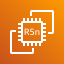

| Category | Service | Icon |
|----------|---------|------|
| Analytics                     | Amazon Athena                                 |                                                                     |
| Analytics                     | Amazon Kinesis Data Streams                   |                                         |
| Analytics                     | AWS Data Exchange                             |                                                             |
| Analytics                     | Amazon EMR                                    |                                                                           |
| Analytics                     | Amazon FinSpace                               |                                                                 |
| Analytics                     | Amazon QuickSight                             |                                                             |
| Analytics                     | AWS Glue DataBrew                             |                                                             |
| Analytics                     | Amazon Redshift                               |                                                                 |
| Analytics                     | Amazon OpenSearch Service                     |                                             |
| Analytics                     | Amazon CloudSearch                            |                                                           |
| Analytics                     | Amazon Kinesis Data Analytics                 |                                     |
| Analytics                     | Amazon Managed Streaming for Apache Kafka     |             |
| Analytics                     | AWS Glue Elastic Views                        |                                                   |
| Analytics                     | AWS Glue                                      |                                                                               |
| Analytics                     | Amazon Kinesis                                |                                                                   |
| Analytics                     | Amazon Kinesis Firehose                       |                                                 |
| Analytics                     | Amazon Kinesis Video Streams                  |                                       |
| Analytics                     | AWS Lake Formation                            |                                                           |
| Analytics                     | AWS Data Pipeline                             |                                                             |
| App-Integration               | Amazon Simple Notification Service            |                     |
| App-Integration               | Amazon Simple Queue Service                   |                                   |
| App-Integration               | Amazon AppFlow                                |                                                             |
| App-Integration               | AWS Express Workflows                         |                                               |
| App-Integration               | Amazon Managed Workflows for Apache Airflow   |   |
| App-Integration               | Amazon API Gateway                            |                                                     |
| App-Integration               | AWS AppSync                                   |                                                                   |
| App-Integration               | AWS Step Functions                            |                                                     |
| App-Integration               | AWS Console Mobile Application                |                             |
| App-Integration               | Amazon MQ                                     |                                                                       |
| App-Integration               | Amazon EventBridge                            |                                                     |
| General-Icons                 | AWS Marketplace_Light                         |                                                 |
| General-Icons                 | AWS Marketplace_Dark                          |                                                   |
| Internet-of-Things            | AWS IoT RoboRunner                            |                                                  |
| Internet-of-Things            | AWS IoT Core                                  |                                                              |
| Internet-of-Things            | AWS IoT SiteWise                              |                                                      |
| Internet-of-Things            | AWS IoT Analytics                             |                                                    |
| Internet-of-Things            | AWS IoT Greengrass                            |                                                  |
| Internet-of-Things            | AWS IoT Device Defender                       |                                        |
| Internet-of-Things            | FreeRTOS                                      |                                                                      |
| Internet-of-Things            | AWS IoT Things Graph                          |                                              |
| Internet-of-Things            | AWS IoT ExpressLink                           |                                                |
| Internet-of-Things            | AWS IoT TwinMaker                             |                                                    |
| Internet-of-Things            | AWS IoT 1 Click                               |                                                        |
| Internet-of-Things            | AWS IoT Events                                |                                                          |
| Internet-of-Things            | AWS IoT EduKit                                |                                                          |
| Internet-of-Things            | AWS IoT FleetWise                             |                                                    |
| Internet-of-Things            | AWS IoT Button                                |                                                          |
| Internet-of-Things            | AWS IoT Device Management                     |                                    |
| Migration-Transfer            | AWS Application Migration Service             |                    |
| Migration-Transfer            | AWS Application Discovery Service             |                    |
| Migration-Transfer            | AWS Migration Evaluator                       |                                        |
| Migration-Transfer            | AWS Mainframe Modernization                   |                                |
| Migration-Transfer            | AWS Migration Hub                             |                                                    |
| Migration-Transfer            | AWS Transfer Family                           |                                                |
| Migration-Transfer            | AWS DataSync                                  |                                                              |
| Migration-Transfer            | AWS Server Migration Service                  |                              |
| Satellite                     | AWS Ground Station                            |                                                           |
| Management-Governance         | AWS Config                                    |                                                               |
| Management-Governance         | AWS AppConfig                                 |                                                         |
| Management-Governance         | AWS Distro for OpenTelemetry                  |                           |
| Management-Governance         | AWS Chatbot                                   |                                                             |
| Management-Governance         | AWS Backint Agent                             |                                                 |
| Management-Governance         | AWS Management Console                        |                                       |
| Management-Governance         | AWS Resilience Hub                            |                                               |
| Management-Governance         | Amazon Managed Service for Prometheus         |         |
| Management-Governance         | AWS Launch Wizard                             |                                                 |
| Management-Governance         | AWS Control Tower                             |                                                 |
| Management-Governance         | Amazon Managed Grafana                        |                                       |
| Management-Governance         | AWS OpsWorks                                  |                                                           |
| Management-Governance         | AWS License Manager                           |                                             |
| Management-Governance         | AWS Proton                                    |                                                               |
| Management-Governance         | AWS Systems Manager Incident Manager          |           |
| Management-Governance         | AWS CloudTrail                                |                                                       |
| Management-Governance         | AWS CloudFormation                            |                                               |
| Management-Governance         | AWS Fault Injection Simulator                 |                         |
| Management-Governance         | AWS Service Catalog                           |                                             |
| Management-Governance         | Amazon CloudWatch                             |                                                 |
| Management-Governance         | AWS Organizations                             |                                                 |
| Management-Governance         | AWS Personal Health Dashboard                 |                         |
| Management-Governance         | AWS Application Auto Scaling                  |                           |
| Management-Governance         | AWS Auto Scaling                              |                                                   |
| Management-Governance         | AWS Systems Manager                           |                                             |
| Management-Governance         | AWS Well Architected Tool                     |                                 |
| Management-Governance         | AWS Trusted Advisor                           |                                             |
| Storage                       | Amazon Simple Storage Service                 |                                       |
| Storage                       | Amazon FSx for OpenZFS                        |                                                     |
| Storage                       | Amazon FSx for Lustre                         |                                                       |
| Storage                       | AWS Storage Gateway                           |                                                           |
| Storage                       | Amazon Simple Storage Service Glacier         |                       |
| Storage                       | AWS Backup                                    |                                                                             |
| Storage                       | Amazon FSx for NetApp ONTAP                   |                                           |
| Storage                       | Amazon FSx                                    |                                                                             |
| Storage                       | Amazon EFS                                    |                                                                             |
| Storage                       | CloudEndure Disaster Recovery                 |                                       |
| Storage                       | AWS Snowball Edge                             |                                                               |
| Storage                       | AWS Snowball                                  |                                                                         |
| Storage                       | AWS Snowcone                                  |                                                                         |
| Storage                       | AWS Snowmobile                                |                                                                     |
| Storage                       | Amazon FSx for WFS                            |                                                             |
| Storage                       | Amazon S3 on Outposts                         |                                                       |
| Storage                       | Amazon Elastic Block Store                    |                                             |
| Cloud-Financial-Management    | Savings Plans                                 |                                                    |
| Cloud-Financial-Management    | Reserved Instance Reporting                   |                        |
| Cloud-Financial-Management    | AWS Application Cost Profiler                 |                    |
| Cloud-Financial-Management    | AWS Cost and Usage Report                     |                            |
| Cloud-Financial-Management    | AWS Billing Conductor                         |                                    |
| Cloud-Financial-Management    | AWS Cost Explorer                             |                                            |
| Cloud-Financial-Management    | AWS Budgets                                   |                                                        |
| Media-Services                | AWS Elemental MediaConvert                    |                                      |
| Media-Services                | AWS Elemental MediaStore                      |                                          |
| Media-Services                | Amazon Elastic Transcoder                     |                                        |
| Media-Services                | AWS Elemental Delta                           |                                                    |
| Media-Services                | AWS Elemental Live                            |                                                      |
| Media-Services                | AWS Elemental MediaPackage                    |                                      |
| Media-Services                | AWS Elemental Appliances & Software           |                    |
| Media-Services                | AWS Elemental Link                            |                                                      |
| Media-Services                | AWS Elemental Server                          |                                                  |
| Media-Services                | Amazon Interactive Video Service              |                          |
| Media-Services                | Amazon Nimble Studio                          |                                                  |
| Media-Services                | AWS Elemental Conductor                       |                                            |
| Media-Services                | Amazon Kinesis Video Streams                  |                                  |
| Media-Services                | AWS Elemental MediaConnect                    |                                      |
| Media-Services                | AWS Elemental MediaLive                       |                                            |
| Media-Services                | AWS Elemental MediaTailor                     |                                        |
| Quantum_Technologies          | Amazon Braket                                 |                                                          |
| Database                      | Amazon Neptune                                |                                                                    |
| Database                      | Amazon RDS on VMware                          |                                                        |
| Database                      | Amazon DynamoDB                               |                                                                  |
| Database                      | Amazon DocumentDB                             |                                                              |
| Database                      | Amazon Aurora                                 |                                                                      |
| Database                      | Amazon RDS                                    |                                                                            |
| Database                      | Amazon Timestream                             |                                                              |
| Database                      | Amazon ElastiCache                            |                                                            |
| Database                      | Amazon MemoryDB for Redis                     |                                              |
| Database                      | AWS Database Migration Service                |                                    |
| Database                      | Amazon Keyspaces                              |                                                                |
| Database                      | Amazon Quantum Ledger Database                |                                    |
| Developer-Tools               | Amazon Corretto                               |                                                           |
| Developer-Tools               | AWS Cloud9                                    |                                                                     |
| Developer-Tools               | AWS Command Line Interface                    |                                     |
| Developer-Tools               | AWS CloudShell                                |                                                             |
| Developer-Tools               | AWS CodeDeploy                                |                                                             |
| Developer-Tools               | AWS CodeArtifact                              |                                                         |
| Developer-Tools               | AWS CodePipeline                              |                                                         |
| Developer-Tools               | AWS CodeStar                                  |                                                                 |
| Developer-Tools               | AWS CodeBuild                                 |                                                               |
| Developer-Tools               | AWS X Ray                                     |                                                                       |
| Developer-Tools               | AWS CodeCommit                                |                                                             |
| Developer-Tools               | AWS Cloud Development Kit                     |                                       |
| Developer-Tools               | AWS Tools and SDKs                            |                                                     |
| Developer-Tools               | AWS Cloud Control API                         |                                               |
| Containers                    | Amazon EKS Distro                             |                                                            |
| Containers                    | AWS Fargate                                   |                                                                        |
| Containers                    | Amazon EKS Cloud                              |                                                              |
| Containers                    | Amazon ECS Anywhere                           |                                                        |
| Containers                    | Amazon Elastic Kubernetes Service             |                            |
| Containers                    | Amazon EKS Anywhere                           |                                                        |
| Containers                    | Red Hat OpenShift                             |                                                            |
| Containers                    | Amazon Elastic Container Registry             |                            |
| Containers                    | Amazon Elastic Container Service              |                              |
| Compute                       | AWS Outposts family                           |                                                           |
| Compute                       | AWS Batch                                     |                                                                               |
| Compute                       | AWS Thinkbox XMesh                            |                                                             |
| Compute                       | Amazon Lightsail                              |                                                                 |
| Compute                       | AWS Thinkbox Stoke                            |                                                             |
| Compute                       | NICE EnginFrame                               |                                                                   |
| Compute                       | Amazon Genomics CLI                           |                                                           |
| Compute                       | AWS Thinkbox Krakatoa                         |                                                       |
| Compute                       | AWS Fargate                                   |                                                                           |
| Compute                       | AWS Thinkbox Sequoia                          |                                                         |
| Compute                       | AWS Compute Optimizer                         |                                                       |
| Compute                       | AWS Outposts servers                          |                                                         |
| Compute                       | AWS Lambda                                    |                                                                             |
| Compute                       | AWS Elastic Beanstalk                         |                                                       |
| Compute                       | Elastic Fabric Adapter                        |                                                     |
| Compute                       | Amazon EC2 R5n                                |                                                                     |
| Compute                       | AWS App Runner                                |                                                                     |
| Compute                       | VMware Cloud on AWS                           |                                                           |
| Compute                       | Amazon EC2 Auto Scaling                       |                                                   |
| Compute                       | Amazon Elastic Container Kubernetes           |                           |
| Compute                       | AWS Thinkbox Deadline                         |                                                       |
| Compute                       | AWS Local Zones                               |                                                                   |
| Compute                       | AWS Wavelength                                |                                                                     |
| Compute                       | Amazon EC2 M5n                                |                                                                     |
| Compute                       | AWS Nitro Enclaves                            |                                                             |
| Compute                       | Amazon Elastic Container Registry             |                               |
| Compute                       | AWS Thinkbox Frost                            |                                                             |
| Compute                       | Amazon Elastic Container Service              |                                 |
| Compute                       | AWS Outposts rack                             |                                                               |
| Compute                       | Bottlerocket                                  |                                                                         |
| Compute                       | Amazon EC2                                    |                                                                             |
| Compute                       | Amazon EC2 Image Builder                      |                                                 |
| Compute                       | AWS ParallelCluster                           |                                                           |
| Compute                       | NICE DCV                                      |                                                                                 |
| Compute                       | AWS Serverless Application Repository         |                       |
| Blockchain                    | Amazon Managed Blockchain                     |                                            |
| Blockchain                    | Amazon Quantum Ledger Database                |                                  |
| Front-End-Web-Mobile          | AWS Amplify                                   |                                                              |
| Front-End-Web-Mobile          | AWS Device Farm                               |                                                      |
| Front-End-Web-Mobile          | Amazon Location Service                       |                                      |
| Business-Applications         | Amazon WorkMail                               |                                                     |
| Business-Applications         | Amazon Chime                                  |                                                           |
| Business-Applications         | Amazon Chime SDK                              |                                                   |
| Business-Applications         | Amazon Pinpoint                               |                                                     |
| Business-Applications         | Amazon Connect                                |                                                       |
| Business-Applications         | Amazon Chime Voice Connector                  |                           |
| Business-Applications         | Alexa For Business                            |                                               |
| Business-Applications         | Amazon Simple Email Service                   |                             |
| Business-Applications         | Amazon Pinpoint APIs                          |                                           |
| Business-Applications         | Amazon WorkDocs SDK                           |                                             |
| Business-Applications         | Amazon Honeycode                              |                                                   |
| Business-Applications         | Amazon WorkDocs                               |                                                     |
| Security-Identity-Compliance  | AWS CloudHSM                                  |                                                    |
| Security-Identity-Compliance  | AWS Key Management Service                    |                        |
| Security-Identity-Compliance  | AWS WAF                                       |                                                              |
| Security-Identity-Compliance  | Amazon GuardDuty                              |                                            |
| Security-Identity-Compliance  | AWS Directory Service                         |                                  |
| Security-Identity-Compliance  | AWS Identity and Access Management            |        |
| Security-Identity-Compliance  | AWS Certificate Manager                       |                              |
| Security-Identity-Compliance  | Amazon Cognito                                |                                                |
| Security-Identity-Compliance  | AWS IAM Identity Center                       |                              |
| Security-Identity-Compliance  | Amazon Macie                                  |                                                    |
| Security-Identity-Compliance  | Amazon Cloud Directory                        |                                |
| Security-Identity-Compliance  | Amazon Detective                              |                                            |
| Security-Identity-Compliance  | Amazon Inspector                              |                                            |
| Security-Identity-Compliance  | AWS Shield                                    |                                                        |
| Security-Identity-Compliance  | AWS Artifact                                  |                                                    |
| Security-Identity-Compliance  | AWS Network Firewall                          |                                    |
| Security-Identity-Compliance  | AWS Resource Access Manager                   |                      |
| Security-Identity-Compliance  | AWS Secrets Manager                           |                                      |
| Security-Identity-Compliance  | AWS Signer                                    |                                                        |
| Security-Identity-Compliance  | AWS Firewall Manager                          |                                    |
| Security-Identity-Compliance  | AWS Audit Manager                             |                                          |
| Security-Identity-Compliance  | AWS Security Hub                              |                                            |
| Robotics                      | AWS RoboMaker                                 |                                                                      |
| VR-AR                         | Amazon Sumerian                               |                                                                     |
| Customer-Enablement           | AWS rePost                                    |                                                                 |
| Customer-Enablement           | AWS IQ                                        |                                                                         |
| Customer-Enablement           | AWS Activate                                  |                                                             |
| Customer-Enablement           | AWS Professional Services                     |                                   |
| Customer-Enablement           | AWS Support                                   |                                                               |
| Customer-Enablement           | AWS Managed Services                          |                                             |
| Customer-Enablement           | AWS Training Certification                    |                                 |
| Networking-Content-Delivery   | Elastic Load Balancing                        |                                 |
| Networking-Content-Delivery   | Amazon Virtual Private Cloud                  |                     |
| Networking-Content-Delivery   | AWS Global Accelerator                        |                                 |
| Networking-Content-Delivery   | AWS Site to Site VPN                          |                                     |
| Networking-Content-Delivery   | AWS Direct Connect                            |                                         |
| Networking-Content-Delivery   | Amazon Cloud Directory                        |                                 |
| Networking-Content-Delivery   | AWS Client VPN                                |                                                 |
| Networking-Content-Delivery   | AWS Private 5G                                |                                                 |
| Networking-Content-Delivery   | Amazon Route 53                               |                                               |
| Networking-Content-Delivery   | AWS Transit Gateway                           |                                       |
| Networking-Content-Delivery   | Amazon CloudFront                             |                                           |
| Networking-Content-Delivery   | AWS PrivateLink                               |                                               |
| Networking-Content-Delivery   | AWS Cloud WAN                                 |                                                   |
| Networking-Content-Delivery   | AWS Cloud Map                                 |                                                   |
| Networking-Content-Delivery   | AWS App Mesh                                  |                                                     |
| Game-Tech                     | Amazon GameSparks                             |                                                             |
| Game-Tech                     | Open 3D Engine                                |                                                                   |
| Game-Tech                     | AWS GameKit                                   |                                                                         |
| Game-Tech                     | Amazon GameLift                               |                                                                 |
| Machine-Learning              | Amazon Augmented AI A2I                       |                                          |
| Machine-Learning              | Amazon Lex                                    |                                                                    |
| Machine-Learning              | AWS Deep Learning Containers                  |                                |
| Machine-Learning              | Amazon Personalize                            |                                                    |
| Machine-Learning              | AWS DeepRacer                                 |                                                              |
| Machine-Learning              | Amazon Kendra                                 |                                                              |
| Machine-Learning              | AWS Deep Learning AMIs                        |                                            |
| Machine-Learning              | Amazon Rekognition                            |                                                    |
| Machine-Learning              | Apache MXNet on AWS                           |                                                  |
| Machine-Learning              | AWS DeepComposer                              |                                                        |
| Machine-Learning              | AWS DeepLens                                  |                                                                |
| Machine-Learning              | Amazon SageMaker Ground Truth                 |                              |
| Machine-Learning              | AWS Panorama                                  |                                                                |
| Machine-Learning              | AWS Neuron                                    |                                                                    |
| Machine-Learning              | Amazon CodeGuru                               |                                                          |
| Machine-Learning              | Amazon Forecast                               |                                                          |
| Machine-Learning              | Amazon Translate                              |                                                        |
| Machine-Learning              | Amazon Textract                               |                                                          |
| Machine-Learning              | Amazon SageMaker                              |                                                        |
| Machine-Learning              | Amazon Lookout for Equipment                  |                                |
| Machine-Learning              | Amazon Transcribe                             |                                                      |
| Machine-Learning              | Amazon DevOps Guru                            |                                                    |
| Machine-Learning              | TorchServe                                    |                                                                    |
| Machine-Learning              | TensorFlow on AWS                             |                                                      |
| Machine-Learning              | Amazon Lookout for Vision                     |                                      |
| Machine-Learning              | Amazon SageMaker Studio Lab                   |                                  |
| Machine-Learning              | Amazon Fraud Detector                         |                                              |
| Machine-Learning              | Amazon Elastic Inference                      |                                        |
| Machine-Learning              | Amazon Comprehend Medical                     |                                      |
| Machine-Learning              | Amazon Polly                                  |                                                                |
| Machine-Learning              | Amazon HealthLake                             |                                                      |
| Machine-Learning              | Amazon Monitron                               |                                                          |
| Machine-Learning              | Amazon Lookout for Metrics                    |                                    |
| Machine-Learning              | Amazon Comprehend                             |                                                      |
| Machine-Learning              | Amazon CodeWhisperer                          |                                                |
| End-User-Computing            | Amazon AppStream                              |                                                      |
| End-User-Computing            | Amazon WorkLink                               |                                                        |
| End-User-Computing            | Amazon WorkSpaces Web                         |                                            |
| End-User-Computing            | Amazon WorkSpaces                             |                                                    |
